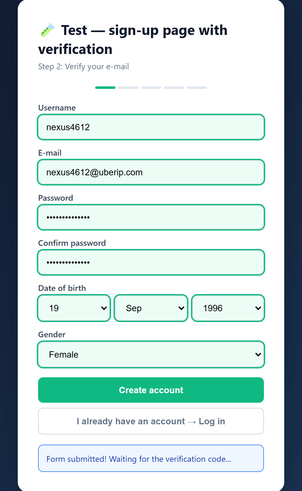
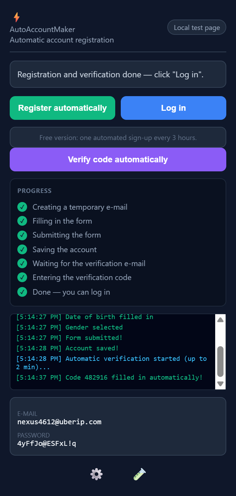
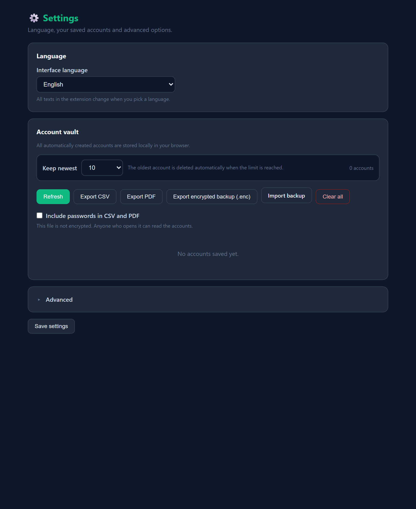
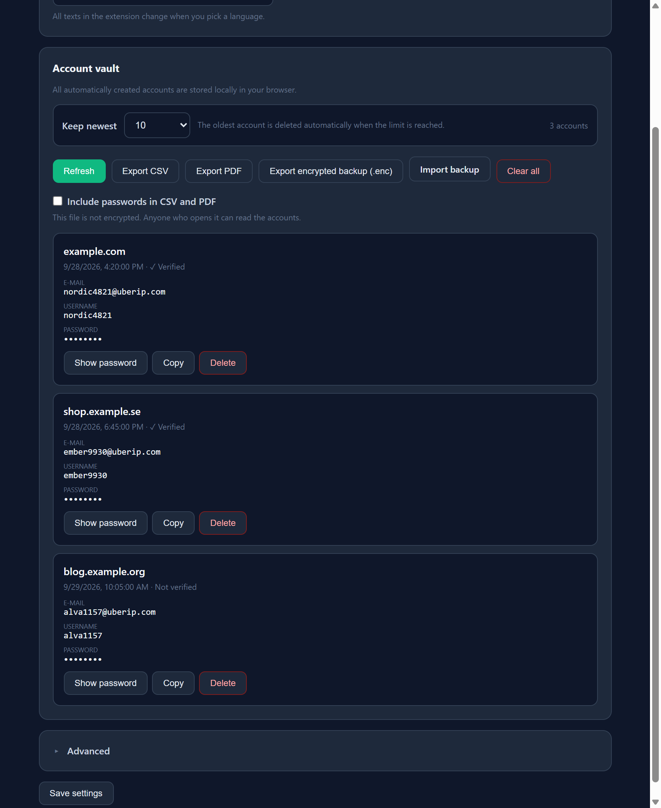

# AutoAccountMaker

Automated sign up for Chrome. Fills in forms, verifies the e mail with a
temporary address, and logs you in. One click.

**Free version:** one automated sign up every three hours.
**Pro:** removes the wait.


*A real run against the built in test page. The account is created, verified,
and logged in. You click once.*

<p align="center">
  
  &nbsp;&nbsp;&nbsp;
  
</p>

*Every field is filled in: first name, last name, e mail, confirmation, password,
date of birth, gender. Fields marked in green were filled in by the extension.*

> Licensed under the Business Source License 1.1. See [LICENSE](LICENSE).

---

## Contents

- [What it does](#what-it-does)
- [Installation](#installation)
- [Usage](#usage)
- [Settings](#settings)
- [Languages](#languages)
- [E mail providers](#e-mail-providers)
- [Exporting accounts](#exporting-accounts)
- [What does not work](#what-does-not-work)
- [Project layout](#project-layout)
- [Development](#development)
- [License](#license)

---

## What it does

Open a page with a sign up form, click the extension icon, and press **Register
automatically**. Everything else happens on its own:

| Step | What happens |
|------|--------------|
| 1 | Creates a temporary e mail address and a password |
| 2 | Fills the form: names, e mail, confirmation, password, country, gender, date of birth |
| 3 | Ticks the required checkboxes, including consent and terms |
| 4 | Submits the form |
| 5 | Waits for the verification e mail |
| 6 | Enters the code or opens the link |
| 7 | Logs in |

The account is saved to the vault. The next time you visit the same site, **Log
in** is all you need.

### Features

- **Form filling** handles ordinary fields, custom `<select>` elements, hand
  built listboxes, and code boxes
- **Shadow DOM support** reaches fields even on sites that build them as web
  components, such as `<w-textfield>`, where plain HTML cannot get in
- **Verification** reads the code from the e mail and enters it, whether the
  page uses a single field or six small boxes
- **Seven languages:** Swedish, English, Turkish, Arabic, Spanish, German,
  French. Arabic is laid out right to left
- **Account vault** stored locally in the browser, with a limit of 10, 50, or 199
- **Export** to CSV, PDF, or an encrypted backup
- **Test page** included, which walks through the whole flow without any outside
  service

---

## Installation

The extension loads straight from the `free-build` folder. Nothing to build, no
npm required.

1. Open `chrome://extensions`
2. Turn on **Developer mode** at the top right
3. Click **Load unpacked**
4. Choose the `free-build` folder

That folder is a complete Chrome MV3 extension. Pick it directly.

### Firefox

Firefox supports MV3, but the `chrome.*` namespace differs in places. Always
test on the browser you intend to ship to. Review `manifest.json` if you repack
it into an `.xpi`.

---

## Usage

1. Open a page with a sign up form
2. Click the extension icon
3. Press **Register automatically**
4. Follow the progress in the log

**After the wait** the button locks and shows the time remaining. It unlocks by
itself when the time is up, so there is nothing to reload.

**Already have an account?** Open the same page again and press **Log in**.

**Want to try it first?** Click 🧪 in the icon row at the bottom of the popup.
That opens a built in test page which runs the entire flow with a real temporary
e mail address.

---

## Settings

Click ⚙️ in the icon row at the bottom of the popup. The page is dark and has
three parts.

**Language** changes the interface. The popup updates immediately, with no need
to close and reopen it.

**Account vault** holds every account you created, with export and delete.

- *Keep newest* sets the limit to 10, 50, or 199. The oldest account is deleted
  automatically once the limit is reached.
- **Show saved accounts** used to live in the popup and now lives here.

**Advanced** is collapsed. It contains the e mail provider and the RapidAPI key.
If you leave it closed you never have to think about it.



<p align="center">
  
</p>

*The vault shows website, e mail, username, verification state, and password
(hidden until you click). Export to CSV, PDF, or an encrypted backup.*

---

## Languages

Seven languages, changed under ⚙️ → Language:

| | | | |
|---|---|---|---|
| 🇬🇧 English | 🇸🇪 Svenska | 🇹🇷 Türkçe | 🇸🇦 العربية |
| 🇪🇸 Español | 🇩🇪 Deutsch | 🇫🇷 Français | |

When you change the language it applies everywhere at once, including in a
popup that is already open.

---

## E mail providers

| Provider | Requirement |
|----------|-------------|
| **mail.tm** (default) | Free, works immediately, no API key |
| **temp mail** (temp mail dot org) | Needs a free [RapidAPI key](https://rapidapi.com/Privatix/api/temp-mail) |

Set under ⚙️ → Advanced. If no key is given, mail.tm is used automatically.

Note that both providers have their own limits on how fast accounts can be
created. That is controlled by them, not by the extension.

---

## Exporting accounts

Everything sits in the same place, ⚙️ → Account vault.

| Format | Contains | Encrypted |
|--------|----------|-----------|
| **CSV** | Website, e mail, username, created, status | No |
| **PDF** | The same details in a clean document | No |
| **.enc** | Everything, including passwords and provider data | Yes, with a master password |

CSV downloads in a single click. PDF opens the browser print dialog, where you
choose **Save as PDF**.

**About passwords:** CSV and PDF leave passwords out by default. Tick **Include
passwords** if you want them included. The encrypted backup always contains
everything, but it needs a master password both on export and on import.

CSV and PDF are **not** encrypted. The file lands in your Documents folder and
can be opened by anyone. Use `.enc` when you need to move accounts safely.

---

## What does not work

Read this before you start.

**Every website is different.** The extension finds fields using heuristics, so
a site with an unusual flow, heavy bot protection, or its own login logic may
refuse the registration or fill the form only partly. No technique works
everywhere, and that does not change here.

**CAPTCHAs are not solved.** Some sites use proof of work as a barrier against
bots. The extension ticks the box and lets the site do its own work, but it
does not build a solver.

**E mail only.** The extension creates e mail addresses, not phone numbers.
Sites that require an SMS code will not work.

**It depends on the e mail provider.** If mail.tm or the other provider rate
limits you, or a message is not delivered, the run fails.

**"Verified" is not a guarantee.** The status means the site accepted the code
you were sent. If a site rejects the account later, that is outside the control
of the extension.

Always test on a site you actually care about before running several.

---

## Project layout

```
docs/            images and the demo used by this file
free-build/      complete extension folder, load this in Chrome
build-free.mjs   generates free-build from the private source tree
free-src/        pieces used by the build
extension/       private source tree (licensing), not published
```

`free-build` is generated, not written by hand. Change something in the private
source tree and run:

```bash
node build-free.mjs
```

The build refuses to finish if a license secret, a key, or any Pro code is
found in the output.

---

## Development

Requires Node 18 or later.

```bash
node build-free.mjs      # build the free version
```

No dependencies are needed for the extension itself. It is plain files, not a
bundled build artifact.

### File overview

| File | Responsibility |
|------|----------------|
| `content.js` | Field detection, filling, one time codes. Runs inside the page |
| `background.js` | Profile generation, e mail, verification, settings |
| `popup.js` | Interface and the flow steps |
| `cooldown.js` | The free tier rate limit |
| `i18n.js` | All seven languages |
| `options.html` / `.js` | Settings, language, and account vault |
| `vault.js` | Account list, export, and import |

---

## License

Business Source License 1.1. See [LICENSE](LICENSE).

- You may use, change, and share this, up to the change date.
- You may **not** sell it, charge for it, or run it as a service for others.
- From **2028-09-29** it becomes Apache License 2.0, and from that day you may
  do as you like with it, including commercially.

If BUSL does not suit your needs, say so. It can be changed to MIT or Apache
2.0 directly.
